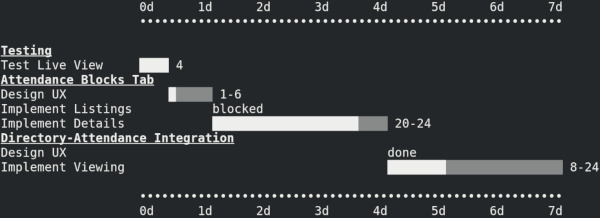

# gantt

An OmniPlan competitor written in Bourne shell.

## Overview

----
Usage: gantt [OPTION]... [FILE]...
Prints a gantt chart from a specially formatted 'agenda' input.

File should be in the form...
  TASK:
  SUBTASK: (status|<INT>[-<INT>])

With no FILE, standard input is read.

  -h, --hours-per-day=NUM  Hours of work per day.
  -t, --tasks=LIST        Comma-separated list of tasks to include. Tasks are
                            referenced by index in the order they appear.
      --help              Print this help.
      --help-example      Print an input example.
      --version           Print version information.

Display can be customized with the following environment variables:
  GANTT_CHART_CHARACTER_MAX (Default: ▒)
    - Character to use for 'maximum estimate' portion of bars.
  GANTT_CHART_CHARACTER_MIN (Default: █)
    - Character to use for 'minumum estimate' portion of bars.
  GANTT_CHART_CHARACTER_TIMELINE (Default: •)
    - Character to use for the timeline decoration.

Piping to a pager is recommended if output exceeds your terminal width.
----

.Example input:
----
# This is an example of the input `gantt` expects.
# Lines starting with a '#' are ignored.
# Whitespace padding is also ignored.
# Hint: try piping this output back into `gantt` to see the visual output.
Testing:
  Test Live View: 4
Attendance Blocks Tab:
  Design UX: 1-6
  Implement Listings: blocked
  Implement Details: 20-24
Directory-Attendance Integration:
  Design UX: done
  Implement Viewing: 8-24
----

.Example output:
----
                   0d      1d      2d      3d      4d      5d      6d      7d
                   ••••••••••••••••••••••••••••••••••••••••••••••••••••••••••

Testing
Test Live View     ████ 4
Attendance Blocks Tab
Design UX              █▒▒▒▒▒ 1-6
Implement Listings           blocked
Implement Details            ████████████████████▒▒▒▒ 20-24
Directory-Attendance Integration
Design UX                                            done
Implement Viewing                                    ████████▒▒▒▒▒▒▒▒▒▒▒▒▒▒▒▒ 8-24

                   ••••••••••••••••••••••••••••••••••••••••••••••••••••••••••
                   0d      1d      2d      3d      4d      5d      6d      7d
----

.Output in GNOME Terminal

## Installation

Drop the shell script located at `bin/gantt` into a `PATH` accessible directory and mark it as executable.

## TODO

### For `1.0.0` release

* [ ] Allow hiding of timeline header and/or footer.
* [ ] Allow ranges for `-t`/`--tasks` parameter.
* [ ] Allow input to consist of only subtasks.
* [ ] Allow auto-paging if output detected to be wider than terminal width.
* [ ] Allow definition of target duration, display as vertical rule in output.
* [ ] Display relevant statistics for current task set.
* [ ] Allow "best-case" task alignment view.
* [ ] Gracefully handle and report malformed input.
* [ ] Gracefully handle and report malformed arguments.
* [ ] Allow each task to show full estimate bar of constituent subtasks.
* [ ] Allow further definition of task alignments.
* [ ] Allow scaling of display.

### Further development

* Simulative prediction.
* Input:
** Calendar - weekends, holidays...
** Assignments - utilization, dependencies...
* Output:
** Image format.
* Graphical interface wrapper.
